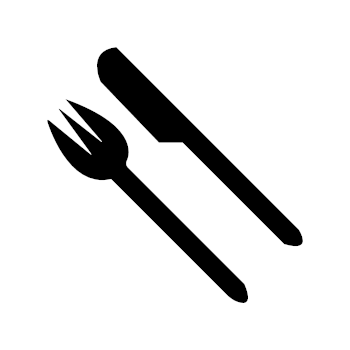
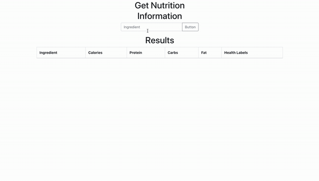
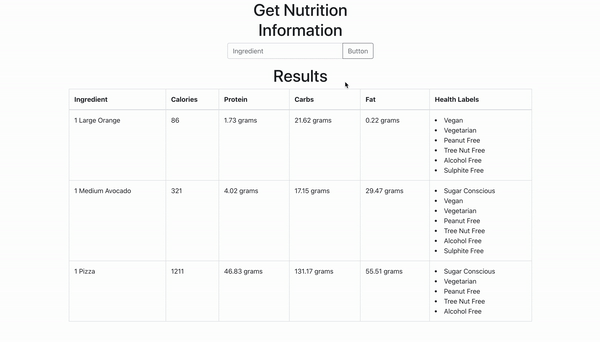

# Nutritionion

## What is the project?

Nutritionion is a web application, built in React and Express, that allows the user to input any ingredient they wish and receive the nutritional information on the inputted ingredient. The user can build a list of the ingredients to see all the nutritional information of their recipes or grocery list in its entirety.

## Installation

To install, clone the directory using the command:

`git clone https://github.com/Andrewgraemebrooks/Nutritionion.git`

After cloning the files run the following npm command:

`npm install`

When downloaded the developer must create their own configuration file here: server/config/config.js. An example configuration file has been provided. The developer must input their own API URL, APP ID and APP KEY. This application is using the [Edamam Nutrition API](https://developer.edamam.com/edamam-nutrition-api).

## Usage

To start both the react and express server, run the following command:

`npm run dev`

The user can then search for any ingredient and the application will fetch the nutritional information for it.

The application also has input validation and error checking.

## License

Nutritionion is [MIT-Licensed](LICENSE)
